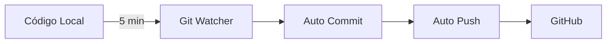
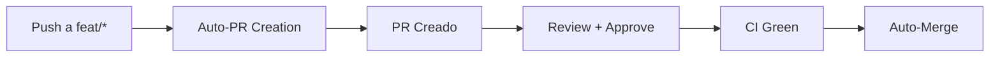
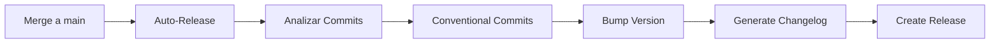

# 🤖 Sistema de Automatización GitOps - AltaMedica

## 🎯 Resumen Ejecutivo

Sistema completo de automatización Git que **elimina la necesidad de commits, PRs y releases manuales**.

### ✨ Características Principales

| Característica | Descripción | Trigger |
|---------------|-------------|---------|
| **Auto-Commit Local** | Detecta y commitea cambios automáticamente | Cada 5 minutos |
| **Auto-Commit Remoto** | Commitea desde GitHub Actions | Cada 30 minutos |
| **Auto-PR Creation** | Crea PRs para branches de features | Push a feat/*, fix/*, etc. |
| **Auto-Merge** | Mergea PRs aprobados con CI verde | Aprobación + CI verde |
| **Auto-Release** | Genera releases con changelog | Push a main + Lunes 9am |
| **Auto-Issues** | Crea issues desde errores en logs | Cada 2 horas (GitOps Master) |
| **PR Monitoring** | Detecta PRs estancados | Cada 2 horas (GitOps Master) |

---

## 🚀 Quick Start

### 1️⃣ Iniciar Git Watcher Local

```bash
cd /root/altamedica-reboot-fresh
./scripts/start-git-watcher.sh
```

### 2️⃣ Desarrollar Normalmente

```bash
# Crear feature branch
git checkout -b feat/nueva-funcionalidad

# Trabajar...
# (El watcher commitea automáticamente cada 5 min)
```

### 3️⃣ Verificar Estado

```bash
# Ver estado del watcher
./scripts/status-git-watcher.sh

# Ver logs en vivo
tail -f git-watcher.log
```

---

## 📦 Componentes

### Scripts Locales

```bash
scripts/
├── git-watcher.sh           # Watcher principal (background)
├── start-git-watcher.sh     # Inicia el watcher
├── stop-git-watcher.sh      # Detiene el watcher
└── status-git-watcher.sh    # Ver estado actual
```

### GitHub Actions Workflows

```bash
.github/workflows/
├── auto-commit-push.yml     # Auto-commit cada 30min
├── auto-pr-creation.yml     # Auto-crear PRs
├── auto-merge.yml           # Auto-merge PRs aprobados
├── auto-release.yml         # Auto-release con changelog
└── gitops-master.yml        # Orquestador maestro
```

---

## 🔧 Configuración

### Git Watcher Local

Editar `scripts/git-watcher.sh`:

```bash
INTERVAL=300          # 5 minutos (300 segundos)
MAX_FILES=500        # Máximo de archivos para auto-commit
```

### GitHub Actions

Todos los workflows están pre-configurados y listos para usar.

**Permisos requeridos en GitHub:**
- Settings → Actions → General → Workflow permissions
- ✅ Read and write permissions
- ✅ Allow GitHub Actions to create and approve pull requests

---

## 📖 Flujo de Trabajo Completo

### Desarrollo Local



### Pull Requests



### Releases



---

## 🎯 Casos de Uso

### Caso 1: Feature Development

```bash
# 1. Crear branch
git checkout -b feat/nueva-funcionalidad

# 2. Desarrollar (auto-commits cada 5 min)
# ... código ...

# 3. PR se crea automáticamente al push

# 4. Revisar y aprobar PR

# 5. Auto-merge cuando CI esté verde
```

### Caso 2: Bug Fix Rápido

```bash
# 1. Crear branch
git checkout -b fix/bug-critico

# 2. Fixear bug (auto-commits cada 5 min)

# 3. PR automático

# 4. Agregar label 'auto-merge'
gh pr edit <NUM> --add-label "auto-merge"

# 5. Aprobar
gh pr review <NUM> --approve

# 6. Auto-merge inmediato
```

### Caso 3: Release Semanal

```bash
# Opción 1: Automático (cada lunes 9am)
# (No hacer nada, el workflow corre solo)

# Opción 2: Manual
gh workflow run auto-release.yml
```

---

## 🐛 Troubleshooting

### Watcher no inicia

```bash
# Verificar estado
./scripts/status-git-watcher.sh

# Limpiar y reiniciar
rm -f .git-watcher.pid
./scripts/start-git-watcher.sh
```

### Watcher no commitea

**Verificar:**
- ¿Estás en branch protegida? (main/master/develop)
- ¿Hay >500 archivos modificados?
- ¿El proceso sigue corriendo? (`ps aux | grep git-watcher`)

### GitHub Actions no corre

**Verificar permisos:**
1. Settings → Actions → General
2. Workflow permissions → Read and write
3. Allow GitHub Actions to create and approve pull requests

### Auto-merge no funciona

**Checklist:**
- [ ] PR tiene label `auto-merge`
- [ ] PR tiene al menos 1 aprobación
- [ ] Todos los checks en verde
- [ ] Sin conflictos de merge

---

## 📊 Monitoreo

### Comandos Útiles

```bash
# Estado del watcher local
./scripts/status-git-watcher.sh

# Logs del watcher
tail -f git-watcher.log

# Ver workflows en GitHub
gh run list

# Ver PRs automáticos
gh pr list --label "auto-generated"

# Ver issues automáticos
gh issue list --label "auto-generated"

# Ver releases
gh release list
```

---

## 🎓 Best Practices

### 1. Usar Conventional Commits

```bash
feat: add new feature       # minor bump
fix: resolve bug            # patch bump
chore: update dependencies  # patch bump
BREAKING CHANGE: ...        # major bump
```

### 2. Branch Naming

```bash
feat/*      # Features
fix/*       # Bug fixes
chore/*     # Maintenance
docs/*      # Documentation
refactor/*  # Code refactoring
```

### 3. Labels para Control

```bash
auto-merge      # PR se mergea automáticamente
auto-generated  # PR/Issue automático
stale           # PR inactivo >7 días
```

### 4. Skip Automation

```bash
# Skip CI
git commit -m "fix: bug [skip ci]"

# Skip release
git commit -m "chore: update [skip release]"
```

---

## 📚 Documentación Completa

Ver [`docs/GITOPS_AUTOMATION.md`](docs/GITOPS_AUTOMATION.md) para documentación detallada.

---

## ✅ Estado del Sistema

- ✅ **Git Watcher**: Implementado y activo
- ✅ **Auto-Commit Push**: Workflow desplegado
- ✅ **Auto-PR Creation**: Workflow desplegado
- ✅ **Auto-Merge**: Workflow desplegado
- ✅ **Auto-Release**: Workflow desplegado
- ✅ **GitOps Master**: Workflow desplegado
- ✅ **Documentación**: Completa

---

## 🎯 Próximos Pasos

1. ✅ Verificar que el watcher hace auto-commits
2. ⏳ Esperar a que GitHub Actions cree PR automático
3. ⏳ Probar auto-merge con PR de prueba
4. ⏳ Validar auto-release en merge a main

---

🤖 **Sistema listo para usar**

Última actualización: 2025-10-04 07:20:00
