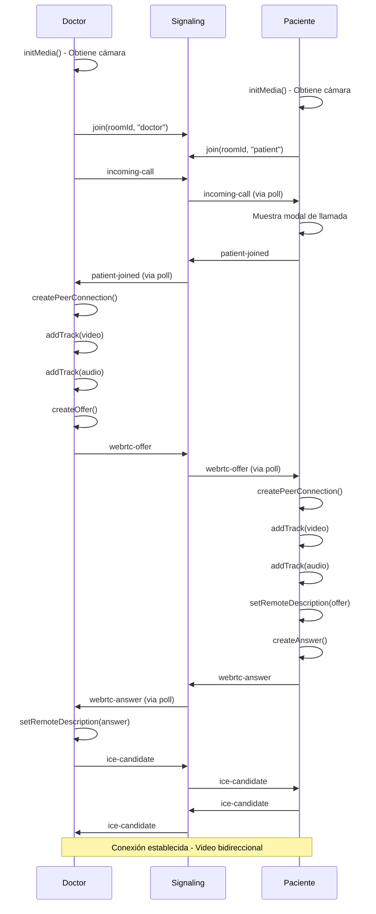

# 🔍 Análisis Completo del Sistema de Videollamadas - AutaMedica

## 📁 Estructura de Archivos y Ubicaciones

### 🏗️ Arquitectura General
```
/root/altamedica-reboot-fresh/
├── apps/
│   ├── doctors/                    # App de médicos (puerto 3001)
│   │   └── src/
│   │       ├── components/
│   │       │   └── dev/
│   │       │       ├── SimpleDoctorVideoCall.tsx    # Componente principal del doctor
│   │       │       └── MediaPicker.tsx              # Selector de dispositivos
│   │       └── app/
│   │           └── dev-call/
│   │               └── page.tsx                     # Página de videollamada doctor
│   │
│   ├── patients/                   # App de pacientes (puerto 3002)
│   │   └── src/
│   │       ├── components/
│   │       │   └── dev/
│   │       │       ├── SimplePatientVideoCall.tsx   # Componente principal del paciente
│   │       │       └── MediaPicker.tsx              # Selector de dispositivos
│   │       └── app/
│   │           └── dev-call/
│   │               └── page.tsx                     # Página de videollamada paciente
│   │
│   └── signaling-server/           # Servidor de señalización (puerto 8787)
│       └── src/
│           ├── http-api.js         # API HTTP para señalización
│           └── index.js            # Entry point del worker
```

## 🔴 PROBLEMA IDENTIFICADO

**Síntoma**: El video remoto del paciente aparece en negro en el lado del doctor, aunque el paciente sí tiene video activo.

**Estado Actual**:
- ✅ Doctor puede iniciar su cámara
- ✅ Paciente puede iniciar su cámara
- ✅ La llamada se establece
- ✅ El paciente ve el video del doctor
- ❌ El doctor NO ve el video del paciente (pantalla negra)

## 📋 Flujo de Comunicación WebRTC

### 1️⃣ **Fase de Inicialización**

#### Doctor (SimpleDoctorVideoCall.tsx)
**Archivo**: `/root/altamedica-reboot-fresh/apps/doctors/src/components/dev/SimpleDoctorVideoCall.tsx`

```typescript
// Línea ~300-330: Inicialización de media
useEffect(() => {
  const initMedia = async () => {
    // Progressive fallback constraints
    const constraints = [
      { video: true, audio: true },
      { video: { width: { ideal: 640 }, height: { ideal: 480 } }, audio: true },
      { video: { facingMode: 'user' }, audio: true },
      { video: false, audio: true }
    ]
    // ...
  }
  initMedia()
}, [])
```

#### Paciente (SimplePatientVideoCall.tsx)
**Archivo**: `/root/altamedica-reboot-fresh/apps/patients/src/components/dev/SimplePatientVideoCall.tsx`

```typescript
// Línea ~230-245: Inicialización cuando acepta llamada
const initMedia = async () => {
  try {
    const mediaStream = await navigator.mediaDevices.getUserMedia({
      video: true,
      audio: true
    })
    setStream(mediaStream)
    // ...
  }
}
```

### 2️⃣ **Fase de Señalización**

#### Servidor HTTP (http-api.js)
**Archivo**: `/root/altamedica-reboot-fresh/apps/signaling-server/src/http-api.js`

**Endpoints principales**:
- `POST /api/join` (línea 45-158): Unirse a sala
- `POST /api/message` (línea 202-253): Enviar mensajes
- `GET /api/poll` (línea 255-295): Obtener mensajes pendientes

**Flujo de mensajes**:
1. Doctor envía `incoming-call` (línea 230-234)
2. Paciente recibe llamada via polling
3. Paciente envía `patient-joined`
4. Doctor envía `webrtc-offer`
5. Paciente envía `webrtc-answer`
6. Ambos intercambian `ice-candidate`

### 3️⃣ **Fase de Conexión WebRTC**

#### Creación de PeerConnection - Doctor
**Archivo**: `/root/altamedica-reboot-fresh/apps/doctors/src/components/dev/SimpleDoctorVideoCall.tsx`
**Líneas**: 57-134

```typescript
const createPeerConnection = () => {
  // Línea 65-73: Configuración
  const pc = new RTCPeerConnection({
    iceServers: [
      { urls: 'stun:stun.l.google.com:19302' },
      { urls: 'stun:stun1.l.google.com:19302' }
    ]
  })

  // Línea 76-86: Manejo de tracks remotos
  pc.ontrack = (event) => {
    console.log(`Received remote track: ${event.track.kind}`)
    if (event.streams && event.streams[0]) {
      setRemoteStream(event.streams[0])
      if (remoteVideoRef.current) {
        remoteVideoRef.current.srcObject = event.streams[0]
      }
    }
  }

  // ⚠️ PROBLEMA POTENCIAL: Línea 111-115
  // Los tracks se agregan aquí pero puede que no sea el momento correcto
  if (stream) {
    stream.getTracks().forEach(track => {
      pc.addTrack(track, stream)
    })
  }
}
```

#### handlePatientJoined - Doctor
**Líneas**: 242-275

```typescript
const handlePatientJoined = async () => {
  // Línea 248: Crea peer connection
  const pc = createPeerConnection()

  // Línea 251-254: Agrega tracks ANTES de crear offer
  stream.getTracks().forEach(track => {
    pc.addTrack(track, stream)
    console.log(`Added ${track.kind} track to peer connection`)
  })

  // Línea 257-258: Crea y envía offer
  const offer = await pc.createOffer()
  await pc.setLocalDescription(offer)
}
```

#### acceptCall - Paciente
**Archivo**: `/root/altamedica-reboot-fresh/apps/patients/src/components/dev/SimplePatientVideoCall.tsx`
**Líneas**: 356-450

```typescript
const acceptCall = async () => {
  // Línea 366: Crea peer connection
  const pc = createPeerConnection()

  // Línea 369-399: Asegura que hay un stream
  let mediaStream = stream
  if (!mediaStream) {
    // Intenta obtener media si no existe
    mediaStream = await navigator.mediaDevices.getUserMedia({ video: true, audio: true })
  }

  // Línea 391-396: Agrega tracks
  if (mediaStream) {
    mediaStream.getTracks().forEach(track => {
      pc.addTrack(track, mediaStream)
      console.log(`Added ${track.kind} track: ${track.label}`)
    })
  }

  // Línea 405: Establece remote description (offer)
  await pc.setRemoteDescription(new RTCSessionDescription(currentOffer))

  // Línea 422-423: Crea answer
  const answer = await pc.createAnswer()
  await pc.setLocalDescription(answer)
}
```

## 🐛 PUNTOS CRÍTICOS DE DEPURACIÓN

### 1. **Verificación de Tracks del Paciente**
```javascript
// En SimplePatientVideoCall.tsx, línea ~393
console.log('Adding tracks to peer connection:')
mediaStream.getTracks().forEach(track => {
  pc.addTrack(track, mediaStream)
  console.log(`  - Added ${track.kind} track: ${track.label}`)
})
```

### 2. **Recepción de Tracks en el Doctor**
```javascript
// En SimpleDoctorVideoCall.tsx, línea ~77
pc.ontrack = (event) => {
  console.log(`Received remote track: ${event.track.kind}`)
  // ¿Se ejecuta esto para los tracks del paciente?
}
```

### 3. **Estado de ICE Candidates**
```javascript
// Ambos archivos tienen monitoring de ICE
pc.oniceconnectionstatechange = () => {
  console.log('ICE connection state:', pc.iceConnectionState)
}
```

## 🔧 HERRAMIENTAS DE PRUEBA

### Test Pages Disponibles:
1. **Test WebRTC Simple**: `/root/altamedica-reboot-fresh/apps/doctors/public/test-webrtc-simple.html`
   - URL: http://localhost:3001/test-webrtc-simple.html
   - Simula doctor y paciente lado a lado

2. **Test Camera Constraints**: `/root/altamedica-reboot-fresh/apps/doctors/public/test-camera-constraints.html`
   - URL: http://localhost:3001/test-camera-constraints.html
   - Prueba diferentes configuraciones de cámara

3. **Test Screen Share**: `/root/altamedica-reboot-fresh/apps/doctors/public/test-screen-share.html`
   - URL: http://localhost:3001/test-screen-share.html
   - Prueba compartir pantalla

## 🎯 POSIBLES CAUSAS DEL PROBLEMA

### 1. **Timing de Agregado de Tracks**
- Los tracks del paciente pueden estar agregándose DESPUÉS de crear el answer
- El peer connection puede no estar en el estado correcto

### 2. **Stream References**
- El `mediaStream` del paciente puede no ser el mismo que se está usando en el video local
- Referencias perdidas entre el stream y los tracks

### 3. **Orden de Operaciones WebRTC**
```
Orden correcto:
1. Crear PeerConnection
2. Agregar tracks locales
3. Crear offer/answer
4. Establecer local description
5. Enviar a peer remoto
6. Establecer remote description
```

### 4. **ICE Gathering**
- Los ICE candidates pueden no estar llegando correctamente
- Problemas de NAT/firewall

## 📊 LOGS A REVISAR

### En el Navegador del Doctor:
1. Abrir Developer Tools (F12)
2. Ir a Console
3. Buscar:
   - "Received remote track"
   - "Connection state"
   - "ICE connection state"

### En el Navegador del Paciente:
1. Abrir Developer Tools (F12)
2. Ir a Console
3. Buscar:
   - "Adding tracks to peer connection"
   - "Added video track"
   - "Added audio track"

### En el Servidor de Señalización:
```bash
# Ver logs del servidor
tail -f /root/altamedica-reboot-fresh/apps/signaling-server/wrangler.log
```

## 🚀 COMANDOS ÚTILES

### Reiniciar Servidores:
```bash
# Detener todos los servidores
pkill -f "pnpm"

# Iniciar doctor app
pnpm --filter doctors dev --port 3001

# Iniciar patient app (nueva terminal)
pnpm --filter patients dev --port 3002

# Iniciar signaling server (nueva terminal)
cd apps/signaling-server && npx wrangler dev --port 8787
```

### Verificar Puertos:
```bash
lsof -i :3001  # Doctor app
lsof -i :3002  # Patient app
lsof -i :8787  # Signaling server
```

## 💡 SOLUCIONES PROPUESTAS

### 1. **Verificar Timing de Tracks**
Asegurar que los tracks se agreguen en el momento correcto:

```typescript
// En SimplePatientVideoCall.tsx
const pc = createPeerConnection()

// PRIMERO: Asegurar stream existe
if (!stream) {
  await initMedia()
}

// SEGUNDO: Agregar tracks
stream.getTracks().forEach(track => {
  pc.addTrack(track, stream)
})

// TERCERO: Procesar offer y crear answer
await pc.setRemoteDescription(offer)
const answer = await pc.createAnswer()
```

### 2. **Debugging Detallado**
Agregar más logging para identificar el punto exacto del fallo:

```typescript
// En ambos componentes
pc.ontrack = (event) => {
  console.log('=== TRACK RECEIVED ===')
  console.log('Track kind:', event.track.kind)
  console.log('Track id:', event.track.id)
  console.log('Track enabled:', event.track.enabled)
  console.log('Track readyState:', event.track.readyState)
  console.log('Streams count:', event.streams.length)
  if (event.streams[0]) {
    console.log('Stream id:', event.streams[0].id)
    console.log('Stream active:', event.streams[0].active)
    console.log('Stream tracks:', event.streams[0].getTracks())
  }
}
```

### 3. **Verificar Compatibilidad de Codecs**
```typescript
// Obtener capacidades
const capabilities = RTCRtpReceiver.getCapabilities('video')
console.log('Video codecs supported:', capabilities.codecs)
```

## 📝 CHECKLIST DE VERIFICACIÓN

- [ ] ¿El paciente tiene permisos de cámara otorgados?
- [ ] ¿Se ejecuta `pc.addTrack()` ANTES de `createAnswer()`?
- [ ] ¿El `ontrack` del doctor se ejecuta para video Y audio?
- [ ] ¿El estado de ICE llega a 'connected' o 'completed'?
- [ ] ¿El `pc.connectionState` llega a 'connected'?
- [ ] ¿Hay errores en la consola del navegador?
- [ ] ¿El signaling server está reenviando todos los mensajes?
- [ ] ¿Los ICE candidates se intercambian correctamente?
- [ ] ¿El stream del paciente tiene tracks activos?
- [ ] ¿El video element tiene autoplay y playsInline?

## 🔄 FLUJO COMPLETO ESPERADO



---

**Este documento contiene toda la información necesaria para analizar y depurar el problema del video remoto en negro.**