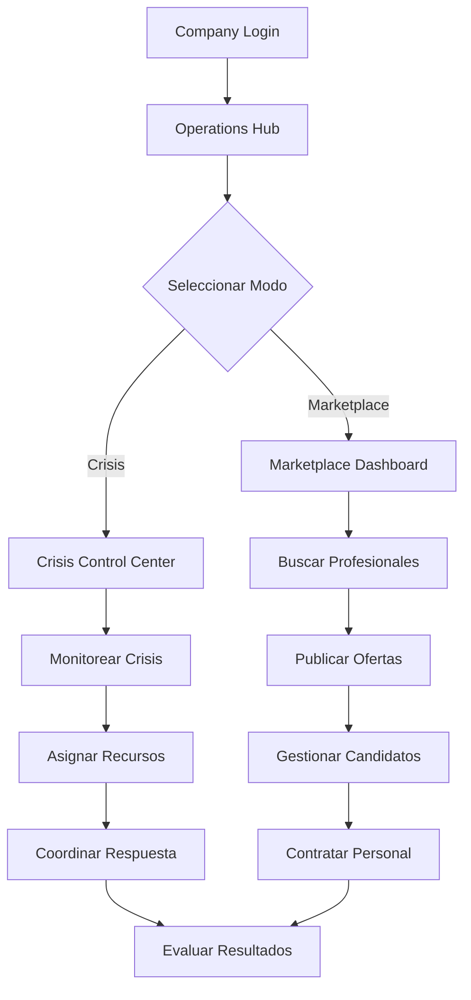

# 🏢 AutaMedica Companies Portal

> **Centro de Control Empresarial** con Crisis Management y Marketplace Médico integrado.
> Solución completa para gestión de crisis sanitarias y contratación de profesionales médicos.

## 🚨 **Crisis Management Center**

### ✅ **Centro de Control de Crisis**
- 🎯 **Dashboard de Crisis** en tiempo real
- 📊 **Métricas de emergencia** y KPIs críticos
- 🗺️ **Mapas de crisis** con geolocalización
- 📡 **Alertas automáticas** y notificaciones
- 👥 **Coordinación de equipos** de respuesta
- 📋 **Protocolos de crisis** predefinidos

### ✅ **Command Center**
- ⚡ **Command Palette** para acciones rápidas
- 🔍 **Búsqueda global** de recursos y personal
- 📈 **Performance Dashboard** de respuesta
- 🎚️ **Controles de asignación** de recursos
- 📊 **CrisisMetrics** con indicadores clave
- 🗺️ **MainMap + NetworkMinimap** integrados

### ✅ **Gestión de Crisis Sanitarias**
- 🏥 **Monitoreo de hospitales** y capacidad
- 🚑 **Dispatch de ambulancias** automático
- 👩‍⚕️ **Asignación de personal** médico
- 📦 **Inventario de suministros** médicos
- 📞 **Comunicaciones de emergencia** seguras

## 💼 **Marketplace Médico IMPLEMENTADO**

### ✅ **Sistema de Contratación Médica**
- 📊 **Dashboard con estadísticas** completas
- 🔍 **Búsqueda avanzada** por especialidad y ubicación
- 💼 **Gestión de ofertas** laborales médicas
- 📈 **Métricas de conversión** (aplicaciones vs visualizaciones)
- 🚨 **Indicadores de urgencia** para puestos críticos
- 💰 **Rangos salariales** transparentes

### ✅ **Especialidades Médicas**
```typescript
// Especialidades disponibles en marketplace
const MEDICAL_SPECIALTIES = {
  'Cardiología': { demand: 'high', urgent: true },
  'Pediatría': { demand: 'medium', urgent: false },
  'Oncología': { demand: 'high', urgent: true },
  'Enfermería': { demand: 'critical', urgent: true },
  'Medicina General': { demand: 'high', urgent: false },
  'Emergencias': { demand: 'critical', urgent: true }
}
```

### ✅ **Toggle Navigation Implementada**
- 🔄 **Navegación fluida** entre Crisis Control y Marketplace
- 🎨 **Tema consistente** (grays/reds/oranges)
- 🔥 **Badge "HOT"** en marketplace como solicitado
- 📱 **Responsive design** adaptativo
- ⚡ **Transiciones sin recargas** de página

## 🚀 **Desarrollo Local**

```bash
# Instalar dependencias (desde root del monorepo)
pnpm install

# Desarrollo solo companies app
pnpm dev --filter @autamedica/companies

# Desarrollo con todas las apps
pnpm dev

# Build production
pnpm build --filter @autamedica/companies
```

**URL Local**: http://localhost:3003

## 🏗️ **Arquitectura Empresarial**

### **Layout Crisis + Marketplace**
```
OperationsHubLayout/
├── Header/                    # Navegación principal empresarial
│   ├── Logo AutaMedica
│   ├── Toggle Crisis/Marketplace
│   ├── Notificaciones Críticas
│   └── Usuario Empresa
├── Navigation/                # Menú lateral contextual
│   ├── [Crisis Mode]
│   │   ├── Dashboard Crisis
│   │   ├── Mapas en Vivo
│   │   ├── Equipos Respuesta
│   │   ├── Recursos Médicos
│   │   └── Comunicaciones
│   └── [Marketplace Mode]
│       ├── Dashboard Jobs
│       ├── Buscar Profesionales
│       ├── Ofertas Activas
│       ├── Candidatos
│       └── Estadísticas
├── MainContent/               # Contenido principal dinámico
│   └── [Crisis Control | Marketplace Dashboard]
└── Footer/                    # Footer empresarial
```

### **Crisis Management Components**
```typescript
// Componentes especializados para crisis
<CrisisControlCenter />        // Centro de control principal
<CrisisMapPanel />            // Panel de mapas con crisis
<CommandPalette />            // Paleta de comandos rápidos
<PerformanceDashboard />      // Dashboard de rendimiento
<CrisisMetrics />             // Métricas de crisis en tiempo real
<MainMap />                   // Mapa principal de crisis
<NetworkMinimap />            // Minimapa de red de recursos
```

### **Marketplace Components**
```typescript
// Componentes del marketplace médico
<MarketplaceDashboard />      // Dashboard principal
<JobListingCard />            // Tarjetas de ofertas laborales
<CandidateProfile />          // Perfiles de candidatos
<SearchFilters />             // Filtros de búsqueda avanzada
<SpecialtySelector />         // Selector de especialidades
<SalaryRangeSlider />         // Control de rangos salariales
<UrgencyIndicator />          // Indicadores de urgencia
```

## 📊 **Métricas y Analytics**

### **Crisis Metrics**
```typescript
// KPIs de crisis en tiempo real
const crisisKPIs = {
  responseTime: '4.2 min avg',
  activeIncidents: 12,
  resourceUtilization: '87%',
  hospitalCapacity: '134/200 beds',
  medicalStaffDeployed: '89/120 available'
}
```

### **Marketplace Analytics**
```typescript
// Métricas del marketplace médico
const marketplaceKPIs = {
  activeJobs: 156,
  applications: 1247,
  viewsToApplications: '12.3%',
  avgTimeToHire: '5.2 days',
  urgentPositions: 23,
  salaryRanges: {
    min: 45000,
    max: 180000,
    currency: 'USD'
  }
}
```

## 🎨 **Design System Empresarial**

### **Tema Crisis Management**
```css
/* Paleta de colores para crisis */
--crisis-primary: #dc2626;      /* Red-600 */
--crisis-secondary: #ea580c;    /* Orange-600 */
--crisis-background: #1f2937;   /* Gray-800 */
--crisis-surface: #374151;      /* Gray-700 */
--crisis-text: #f9fafb;         /* Gray-50 */
--crisis-accent: #f59e0b;       /* Amber-500 */
```

### **Componentes UI Especializados**
- 🚨 **AlertBanner**: Alertas críticas prioritarias
- 📊 **MetricCard**: Tarjetas de métricas clave
- 🗺️ **InteractiveMap**: Mapas interactivos de crisis
- 💼 **JobCard**: Tarjetas de ofertas laborales
- ⚡ **QuickAction**: Botones de acción rápida
- 🎯 **StatusIndicator**: Indicadores de estado visual

## 🔧 **Funcionalidades Avanzadas**

### **Command Palette**
```typescript
// Sistema de comandos rápidos
const commandPalette = {
  'crisis:new': 'Crear nueva crisis',
  'dispatch:ambulance': 'Despachar ambulancia',
  'staff:assign': 'Asignar personal médico',
  'marketplace:post': 'Publicar nueva oferta',
  'candidate:search': 'Buscar candidatos',
  'reports:generate': 'Generar reporte'
}
```

### **Real-time Updates**
```typescript
// WebSocket para actualizaciones en tiempo real
useWebSocket('/api/crisis-updates', {
  onCrisisUpdate: updateCrisisDashboard,
  onJobApplication: updateMarketplace,
  onResourceChange: updateResourceMap
})
```

## 🚀 **Deployment**

### **Cloudflare Pages**
- **URL Producción**: https://autamedica-companies.pages.dev ✅
- **Build Command**: `pnpm turbo run build --filter=@autamedica/companies`
- **Output Directory**: `.next/`
- **Root Directory**: `apps/companies`

### **Variables de Entorno**
```bash
NEXT_PUBLIC_SUPABASE_URL=https://gtyvdircfhmdjiaelqkg.supabase.co
NEXT_PUBLIC_SUPABASE_ANON_KEY=eyJh...
NEXT_PUBLIC_MAPBOX_TOKEN=pk.eyJ... # Para mapas de crisis
NODE_ENV=production
HUSKY=0
```

## 📦 **Dependencies Empresariales**

### **Core**
- `next`: 15.5.0 (App Router + RSC)
- `react`: 18.2.0
- `typescript`: 5.9.2

### **Crisis Management**
- `@mapbox/mapbox-gl-js`: Mapas interactivos
- `socket.io-client`: Real-time updates
- `chart.js`: Gráficos de métricas
- `date-fns`: Manejo de fechas de crisis

### **Marketplace**
- `@supabase/supabase-js`: ^2.39.0
- `@autamedica/types`: workspace:^ (Tipos médicos)
- `@autamedica/hooks`: workspace:^ (Hooks empresariales)
- `@autamedica/auth`: workspace:^ (Auth empresarial)

### **UI/Charts**
- `recharts`: Gráficos de analytics
- `lucide-react`: ^0.263.1 (Icons empresariales)
- `@autamedica/tailwind-config`: workspace:^
- `framer-motion`: Animaciones de transición

## 🔧 **Scripts Empresariales**

```bash
pnpm dev          # Desarrollo con hot reload
pnpm build        # Build optimizado para producción
pnpm start        # Servidor empresarial de producción
pnpm lint         # ESLint + reglas empresariales
pnpm type-check   # Verificación tipos empresariales
```

## 🏥 **Flujo Empresarial**



## 🔒 **Seguridad Empresarial**

### **Controles de Acceso**
- ✅ **Roles empresariales**: Admin, Manager, Operator
- ✅ **Permisos granulares** por función crítica
- ✅ **Audit trail** de decisiones de crisis
- ✅ **Encriptación** de comunicaciones sensibles
- ✅ **2FA obligatorio** para funciones críticas

### **Compliance**
- ✅ **SOC 2 Type II** compliance para datos empresariales
- ✅ **HIPAA compliance** para datos médicos
- ✅ **Disaster recovery** procedures documentados
- ✅ **Business continuity** planning integrado

## 📊 **Reporting y Analytics**

```typescript
// Reportes empresariales automatizados
const enterpriseReports = {
  crisis: {
    responseEfficiency: 'Eficiencia de respuesta',
    resourceUtilization: 'Utilización de recursos',
    outcomeAnalysis: 'Análisis de resultados'
  },
  marketplace: {
    hiringFunnel: 'Embudo de contratación',
    timeToHire: 'Tiempo de contratación',
    costPerHire: 'Costo por contratación',
    retentionRates: 'Tasas de retención'
  }
}
```

## 📄 **Licencia**

Proprietary - AutaMedica Healthcare Platform © 2025