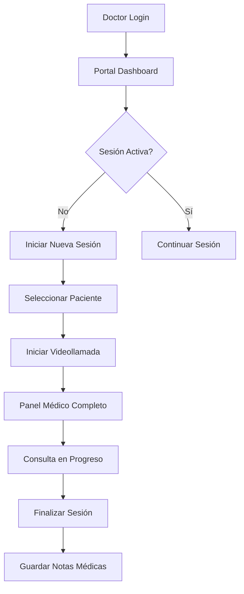

# 👨‍⚕️ AutaMedica Doctors Portal

> **Portal Médico Profesional** con sistema de videollamadas, gestión de pacientes y componentes médicos especializados.
> Diseñado específicamente para profesionales de la salud con interfaz estilo VSCode.

## 🩺 **Funcionalidades Médicas Implementadas**

### ✅ **Sistema de Videollamadas WebRTC**
- 🎥 **Videollamadas médicas** en tiempo real
- 🎙️ **Controles de audio/video** profesionales
- 📊 **Monitoreo de calidad** de conexión y latencia
- 🔒 **Conexiones seguras** HIPAA-compliant

### ✅ **Sistema Médico Completo**
- 📋 **Información de pacientes** en tiempo real
- 🏥 **6 Componentes médicos** especializados:
  - `PatientInfoTab` - Información personal y demográfica
  - `MedicalHistoryTab` - Historial médico completo
  - `PrescriptionsTab` - Prescripciones y medicamentos
  - `VitalSignsTab` - Signos vitales y monitores
  - `AIHistoryTab` - Análisis de IA médica
  - `DoctorsPortalShell` - Layout principal médico

### ✅ **Hooks Médicos Especializados**
- `usePatientData` - Gestión de datos de pacientes con Supabase
- `useActiveSession` - Sesiones médicas activas
- `useMedicalHistory` - Historial clínico completo
- `useVitalSigns` - Signos vitales en tiempo real
- `usePrescriptions` - Gestión de prescripciones
- `useAIAnalysis` - Análisis de IA médica

### ✅ **UUID Problem RESUELTO**
- ❌ **Error anterior**: "invalid input syntax for type uuid: 'demo-patient-1'"
- ✅ **Solución implementada**: Sistema dinámico con UUIDs válidos
- 🔧 **UUID demo**: `550e8400-e29b-41d4-a716-446655440000`
- 📊 **Paciente demo**: María González, 32 años, Consulta general

## 🚀 **Desarrollo Local**

```bash
# Instalar dependencias (desde root del monorepo)
pnpm install

# Desarrollo solo doctors app
pnpm dev --filter @autamedica/doctors

# Desarrollo con todas las apps
pnpm dev

# Build production
pnpm build --filter @autamedica/doctors
```

**URL Local**: http://localhost:3001

## 🏗️ **Arquitectura Médica**

### **Layout Estilo VSCode**
```
DoctorsPortalShell/
├── Header/                    # Navegación médica + usuario
├── Sidebar/                   # Tabs médicos navegables
│   ├── Información del Paciente
│   ├── Historial Médico
│   ├── Prescripciones
│   ├── Signos Vitales
│   └── Análisis IA
├── MainContent/               # Videollamada principal
│   ├── VideoContainer/        # Stream WebRTC
│   ├── AudioControls/         # Mute/Unmute
│   ├── VideoControls/         # Camera On/Off
│   └── CallQuality/           # Latencia + Estado
└── InfoPanel/                 # Info paciente en tiempo real
```

### **Flujo de Datos Médicos**
```typescript
// Flujo de sesión médica
useActiveSession() → {
  patientId: UUID,
  sessionType: 'general' | 'seguimiento' | 'urgencia',
  status: 'en_progreso'
}

usePatientData(patientId) → {
  patient: PatientProfile,
  loading: boolean,
  error: string | null
}
```

## 🔧 **Integración Supabase Medical**

### **Configuración Database**
```typescript
// lib/supabase.ts
createClient(
  NEXT_PUBLIC_SUPABASE_URL,
  NEXT_PUBLIC_SUPABASE_ANON_KEY
)

// Tablas médicas
- patients: PatientProfile
- medical_history: MedicalRecord[]
- prescriptions: Prescription[]
- vital_signs: VitalSigns[]
- sessions: ActiveSession[]
```

### **Tipos TypeScript Médicos**
```typescript
// types/medical.ts
interface PatientProfile {
  id: UUID
  first_name: string
  last_name: string
  age: number
  blood_type?: string
  allergies?: string[]
  chronic_conditions?: string[]
  // ... más campos médicos
}

interface ActiveSessionData {
  patientId: UUID | null
  sessionId: UUID | null
  sessionType: 'general' | 'seguimiento' | 'urgencia' | 'especialidad'
  startTime: string | null
  status: 'en_progreso' | 'completada'
}
```

## 🎨 **UI/UX Médico Profesional**

### **Design System Médico**
- **Layout VSCode**: Familiar para profesionales tech-savvy
- **Colores médicos**: Gray-800/900 con acentos azules
- **Tipografía**: Inter font optimizada para lectura clínica
- **Iconografía**: Lucide icons médicos específicos
- **Responsive**: Optimizado para tablets médicos

### **Componentes Especializados**
```typescript
// Componentes médicos reutilizables
<InfoCard title="Paciente" value="María González, 32 años" />
<InfoCard title="Consulta" value="Consulta general" />
<InfoCard title="Duración" value="00:00" />
<InfoCard title="Calidad" value="En espera" />
<InfoCard title="Latencia" value="—" />
```

## 🎥 **Sistema WebRTC Videollamadas**

### **Configuración WebRTC**
```typescript
// Configuración estándar para videollamadas médicas
const mediaConstraints = {
  video: {
    width: 1280,
    height: 720,
    facingMode: 'user'
  },
  audio: {
    echoCancellation: true,
    noiseSuppression: true
  }
}
```

### **Signaling Server**
- **Servidor WebRTC**: `apps/signaling-server`
- **Protocolo**: WebSocket + Socket.io
- **Salas médicas**: Identificadas por sessionId
- **Seguridad**: Tokens JWT + validación roles

## 🚀 **Deployment**

### **Cloudflare Pages**
- **URL Producción**: https://autamedica-doctors.pages.dev ✅
- **Build Command**: `pnpm turbo run build --filter=@autamedica/doctors`
- **Output Directory**: `.next/`
- **Root Directory**: `apps/doctors`

### **Variables de Entorno**
```bash
NEXT_PUBLIC_SUPABASE_URL=https://gtyvdircfhmdjiaelqkg.supabase.co
NEXT_PUBLIC_SUPABASE_ANON_KEY=***REDACTED***
NODE_ENV=production
HUSKY=0
```

## 📦 **Dependencies Médicas**

### **Core**
- `next`: 15.5.0 (App Router + RSC)
- `react`: 18.2.0
- `typescript`: 5.9.2

### **Médico/Health**
- `@supabase/supabase-js`: ^2.39.0 (Database médica)
- `@autamedica/types`: workspace:^ (Tipos médicos)
- `@autamedica/hooks`: workspace:^ (Hooks médicos)
- `@autamedica/auth`: workspace:^ (Auth médica)

### **WebRTC/Video**
- `socket.io-client`: Para signaling WebRTC
- Web APIs nativas: `getUserMedia`, `RTCPeerConnection`

### **UI Médica**
- `lucide-react`: ^0.263.1 (Icons médicos)
- `@autamedica/tailwind-config`: workspace:^

## 🔧 **Scripts Médicos**

```bash
pnpm dev          # Desarrollo con hot reload médico
pnpm build        # Build optimizado para producción
pnpm start        # Servidor médico de producción
pnpm lint         # ESLint + reglas médicas
pnpm type-check   # Verificación tipos médicos
```

## 🏥 **Flujo de Trabajo Médico**



## 🔒 **Seguridad Médica**

- ✅ **HIPAA Compliance**: Datos médicos encriptados
- ✅ **Autenticación SSO**: Via @autamedica/auth
- ✅ **Roles médicos**: Validación de acceso por especialidad
- ✅ **WebRTC seguro**: DTLS + SRTP encryption
- ✅ **Audit trail**: Registro de accesos a datos de pacientes

## 📄 **Licencia**

Proprietary - AutaMedica Healthcare Platform © 2025