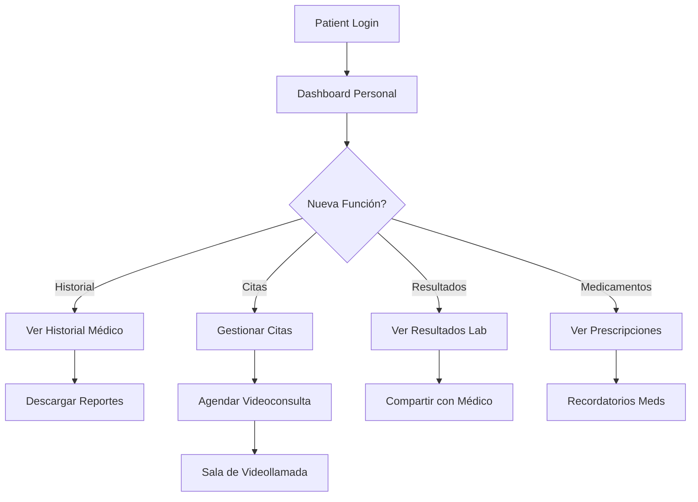

# 👤 AutaMedica Patients Portal

> **Portal Personal del Paciente** con historial médico, citas, resultados y seguimiento de tratamientos.
> Diseñado con layout modular y sistema de temas para una experiencia personalizada.

## 🏥 **Funcionalidades para Pacientes**

### ✅ **Historial Médico Personal**
- 📋 **Historial clínico** completo y cronológico
- 🧪 **Resultados de laboratorio** con gráficos visuales
- 💊 **Medicamentos actuales** y prescripciones
- 🩺 **Signos vitales** y monitoreo continuo
- 📊 **Reportes médicos** descargables

### ✅ **Gestión de Citas**
- 📅 **Calendario de citas** médicas
- 🔔 **Recordatorios** automáticos
- 👨‍⚕️ **Selección de especialistas** y horarios
- 🎥 **Videoconsultas** directas con médicos
- ⏰ **Reprogramación** flexible de citas

### ✅ **Portal Personal**
- 👤 **Perfil personal** editable
- 🛡️ **Información de seguro** médico
- 📱 **Contactos de emergencia**
- 🏠 **Datos de contacto** actualizables
- 🔐 **Privacidad y permisos** de datos

### ✅ **Sistema de Temas**
- 🎨 **Temas visuales** personalizables
- 🌙 **Modo oscuro/claro** adaptativo
- 🎯 **Accesibilidad** mejorada
- 📱 **Responsive design** mobile-first
- 🔧 **Configuración visual** persistente

## 🚀 **Desarrollo Local**

```bash
# Instalar dependencias (desde root del monorepo)
pnpm install

# Desarrollo solo patients app
pnpm dev --filter @autamedica/patients

# Desarrollo con todas las apps
pnpm dev

# Build production
pnpm build --filter @autamedica/patients
```

**URL Local**: http://localhost:3002

## 🏗️ **Arquitectura Modular**

### **Layout Modular Responsivo**
```
PatientLayoutModular/
├── PatientHeaderModular/      # Header con navegación personalizada
│   ├── Logo AutaMedica
│   ├── Menú Principal
│   ├── Notificaciones
│   └── Perfil Usuario
├── PatientSidebarModular/     # Sidebar navegacional
│   ├── Dashboard
│   ├── Mi Historial
│   ├── Mis Citas
│   ├── Resultados Lab
│   ├── Medicamentos
│   └── Configuración
├── MainContent/               # Contenido principal
│   └── [Dynamic Sections]
└── PatientFooterModular/      # Footer con info médica
    ├── Enlaces Útiles
    ├── Contacto Emergencia
    └── Política Privacidad
```

### **Componentes de Datos Médicos**
```typescript
// Componentes especializados para pacientes
<LabResultCard />           // Tarjetas de resultados
<LabResultDetailCard />     // Detalle de análisis
<LabResultFilters />        // Filtros de búsqueda
<PrescriptionCard />        // Tarjetas de medicamentos
<PrescriptionDetailCard />  // Detalle de prescripciones
<PrescriptionFilters />     // Filtros de medicamentos
<PatientDataExportModal />  // Exportación de datos
<ExportDataButton />        // Botón descarga reports
```

## 🎨 **Sistema de Temas Personalizable**

### **Temas Disponibles**
```typescript
// Configuración de temas médicos
const PATIENT_THEMES = {
  default: {
    primary: 'blue-600',
    secondary: 'blue-100',
    background: 'white',
    text: 'gray-900'
  },
  dark: {
    primary: 'blue-400',
    secondary: 'blue-900',
    background: 'gray-900',
    text: 'gray-100'
  },
  healthcare: {
    primary: 'green-600',
    secondary: 'green-100',
    background: 'green-50',
    text: 'gray-800'
  }
}
```

### **Configuración Persistente**
```typescript
// Hook para persistencia de temas
useThemePreference() → {
  theme: string,
  setTheme: (theme: string) => void,
  savedTheme: string
}
```

## 🔧 **Integración Médica**

### **Datos del Paciente**
```typescript
// Hooks especializados para pacientes
usePatientProfile() → PatientProfile
useLabResults() → LabResult[]
usePrescriptions() → Prescription[]
useAppointments() → Appointment[]
useMedicalHistory() → MedicalRecord[]
```

### **Exportación de Datos**
```typescript
// Sistema de exportación GDPR-compliant
const exportOptions = {
  pdf: 'Reporte médico completo',
  csv: 'Datos tabulares',
  json: 'Datos estructurados',
  xlsx: 'Excel para análisis'
}
```

## 📊 **Visualización de Datos Médicos**

### **Dashboards Personalizados**
- 📈 **Gráficos de signos vitales** en tiempo real
- 🧪 **Tendencias de laboratorio** con comparativas
- 💊 **Adherencia a medicamentos** con recordatorios
- 🎯 **Objetivos de salud** y progreso
- 📋 **Resumen médico** para médicos

### **Componentes Visuales**
```typescript
// Componentes de visualización médica
<VitalSignsChart data={vitals} />
<LabTrendsChart results={labResults} />
<MedicationCalendar prescriptions={meds} />
<HealthGoalsProgress goals={goals} />
<MedicalTimeline history={records} />
```

## 🚀 **Deployment**

### **Cloudflare Pages**
- **URL Producción**: https://autamedica-patients.pages.dev ✅
- **Build Command**: `pnpm turbo run build --filter=@autamedica/patients`
- **Output Directory**: `.next/`
- **Root Directory**: `apps/patients`

### **Variables de Entorno**
```bash
NEXT_PUBLIC_SUPABASE_URL=https://gtyvdircfhmdjiaelqkg.supabase.co
NEXT_PUBLIC_SUPABASE_ANON_KEY=***REDACTED***
NODE_ENV=production
HUSKY=0
```

## 📦 **Dependencies Especializadas**

### **Core**
- `next`: 15.5.0 (App Router + RSC)
- `react`: 18.2.0
- `typescript`: 5.9.2

### **Datos Médicos**
- `@supabase/supabase-js`: ^2.39.0
- `@autamedica/types`: workspace:^ (Tipos médicos)
- `@autamedica/hooks`: workspace:^ (Hooks pacientes)
- `@autamedica/auth`: workspace:^ (Auth pacientes)

### **UI/Visualización**
- `recharts`: Para gráficos médicos
- `date-fns`: Manejo de fechas médicas
- `lucide-react`: ^0.263.1 (Icons médicos)
- `@autamedica/tailwind-config`: workspace:^

### **Exportación**
- `jsPDF`: Generación PDFs médicos
- `xlsx`: Exportación Excel
- `html2canvas`: Screenshots de datos

## 🔧 **Scripts del Paciente**

```bash
pnpm dev          # Desarrollo con hot reload
pnpm build        # Build optimizado para producción
pnpm start        # Servidor de producción
pnpm lint         # ESLint + reglas médicas
pnpm type-check   # Verificación tipos médicos
```

## 🏥 **Flujo del Paciente**



## 🔒 **Privacidad del Paciente**

### **Controles de Privacidad**
- ✅ **Consentimiento informado** para compartir datos
- ✅ **Controles granulares** de permisos
- ✅ **Exportación GDPR** de datos personales
- ✅ **Derecho al olvido** implementado
- ✅ **Audit trail** de accesos a datos

### **Compartir Datos Médicos**
```typescript
// Sistema de compartir datos controlado
const sharePermissions = {
  doctors: ['full_access', 'read_only', 'emergency_only'],
  family: ['basic_info', 'emergency_contact'],
  insurance: ['claims_only', 'verification_only']
}
```

## 📱 **Experiencia Mobile**

- 📱 **PWA Ready**: Instalable como app nativa
- 🔔 **Push notifications**: Recordatorios de medicamentos
- 📶 **Offline support**: Cache de datos críticos
- 👆 **Touch optimized**: Gestos intuitivos
- 🔋 **Battery efficient**: Optimizado para móviles

## 🧪 **Testing Médico**

```bash
# Tests específicos para datos médicos
pnpm test:patient-data     # Tests de datos de pacientes
pnpm test:privacy         # Tests de privacidad
pnpm test:export          # Tests de exportación
pnpm test:themes          # Tests de temas
pnpm test:accessibility   # Tests de accesibilidad
```

## 📄 **Licencia**

Proprietary - AutaMedica Healthcare Platform © 2025