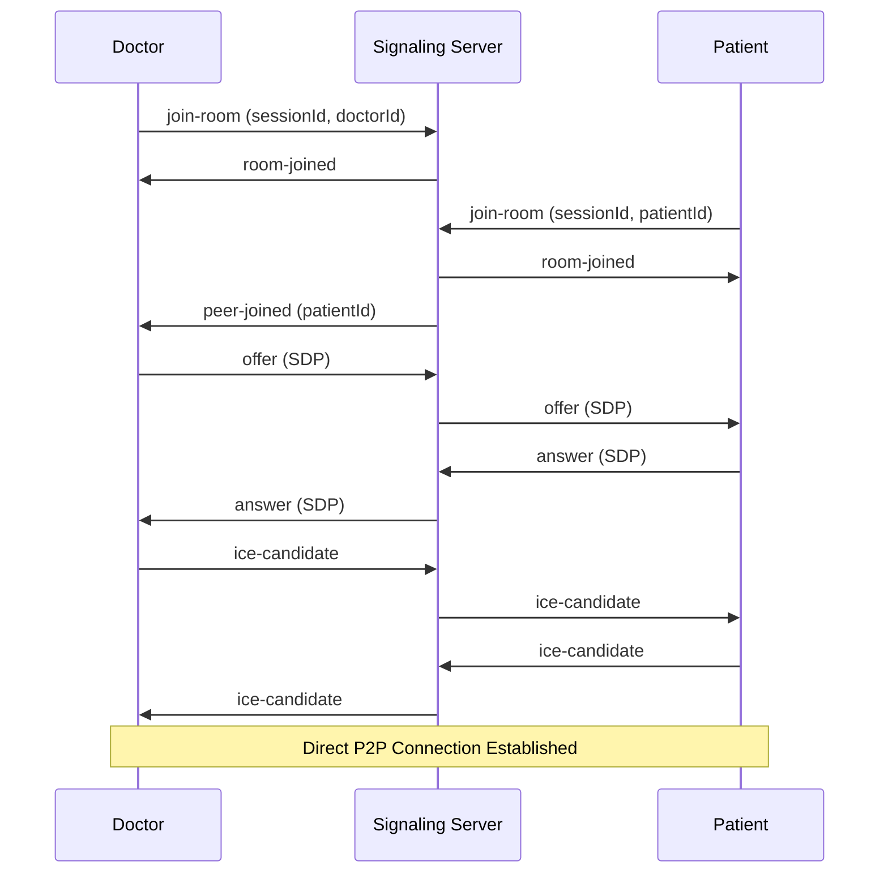

# 📡 AutaMedica Signaling Server

> **WebRTC Signaling Server** especializado para videollamadas médicas seguras.
> Microservicio independiente que facilita conexiones peer-to-peer entre médicos y pacientes.

## 🎯 **Funcionalidades WebRTC**

### ✅ **Signaling WebRTC**
- 🔄 **Intercambio SDP** (Session Description Protocol)
- 🧊 **ICE Candidates** handling automático
- 🏠 **Gestión de salas** médicas por sessionId
- 📡 **WebSocket connections** bidireccionales
- ⚡ **Real-time messaging** entre peers
- 🔒 **Conexiones seguras** DTLS + SRTP

### ✅ **Salas Médicas**
```typescript
// Estructura de salas médicas
interface MedicalRoom {
  sessionId: UUID
  doctorId: UUID
  patientId: UUID
  roomType: 'consultation' | 'emergency' | 'follow-up'
  participants: Participant[]
  createdAt: ISODateString
  status: 'waiting' | 'active' | 'ended'
}
```

### ✅ **Gestión de Participantes**
- 👨‍⚕️ **Roles médicos**: doctor, patient, observer
- 📊 **Estado de conexión** en tiempo real
- 🎥 **Control de media streams** (audio/video)
- 🔐 **Autenticación** basada en JWT tokens
- 📝 **Logging de sesiones** para auditoría

## 🚀 **Desarrollo Local**

```bash
# Instalar dependencias (desde root del monorepo)
pnpm install

# Desarrollo signaling server
pnpm dev --filter signaling-server

# Build production
pnpm build --filter signaling-server

# Ejecutar en producción
pnpm start --filter signaling-server
```

**URL Local**: http://localhost:8080 (WebSocket: ws://localhost:8080)

## 🏗️ **Arquitectura WebRTC**

### **Flujo de Signaling**


### **Estructura del Servidor**
```
signaling-server/
├── src/
│   ├── index.ts              # Entry point + Express server
│   ├── signaling-server.ts   # WebSocket signaling logic
│   ├── logger.ts             # Logging médico especializado
│   ├── validation.ts         # Validación de datos médicos
│   └── env.ts                # Configuración de entorno
├── package.json              # Dependencies + scripts
└── tsconfig.json            # TypeScript configuration
```

## 🔧 **API WebSocket**

### **Eventos de Conexión**
```typescript
// Eventos del cliente hacia servidor
interface ClientEvents {
  'join-room': {
    sessionId: UUID
    userId: UUID
    userType: 'doctor' | 'patient'
    authToken: string
  }

  'leave-room': {
    sessionId: UUID
    userId: UUID
  }

  'offer': {
    sessionId: UUID
    fromUserId: UUID
    toUserId: UUID
    sdp: RTCSessionDescriptionInit
  }

  'answer': {
    sessionId: UUID
    fromUserId: UUID
    toUserId: UUID
    sdp: RTCSessionDescriptionInit
  }

  'ice-candidate': {
    sessionId: UUID
    fromUserId: UUID
    toUserId: UUID
    candidate: RTCIceCandidateInit
  }
}
```

### **Eventos del Servidor**
```typescript
// Eventos del servidor hacia cliente
interface ServerEvents {
  'room-joined': {
    sessionId: UUID
    participants: Participant[]
  }

  'peer-joined': {
    sessionId: UUID
    userId: UUID
    userType: 'doctor' | 'patient'
  }

  'peer-left': {
    sessionId: UUID
    userId: UUID
  }

  'offer': SignalingMessage
  'answer': SignalingMessage
  'ice-candidate': SignalingMessage

  'error': {
    code: string
    message: string
  }
}
```

## 🔒 **Seguridad Médica**

### **Autenticación**
```typescript
// Validación de tokens JWT médicos
interface AuthToken {
  userId: UUID
  userType: 'doctor' | 'patient'
  sessionId: UUID
  permissions: string[]
  exp: number
  iat: number
}
```

### **Validaciones de Seguridad**
- ✅ **JWT token validation** en cada conexión
- ✅ **Verificación de permisos** por sala médica
- ✅ **Rate limiting** para prevenir abuse
- ✅ **IP whitelisting** para instituciones médicas
- ✅ **Audit logging** de todas las conexiones
- ✅ **Automatic session cleanup** por timeout

### **Compliance**
- ✅ **HIPAA compliance** para comunicaciones médicas
- ✅ **Logs médicos** con retención regulada
- ✅ **Encriptación** de metadatos de sesión
- ✅ **Anonimización** de datos sensibles en logs

## 📊 **Monitoring y Logging**

### **Métricas de Rendimiento**
```typescript
// Métricas del signaling server
interface ServerMetrics {
  activeConnections: number
  activeSessions: number
  messagesPerSecond: number
  avgConnectionTime: number
  errorRate: number
  memoryUsage: number
  cpuUsage: number
}
```

### **Logging Especializado**
```typescript
// Logger médico con contexto
logger.info('Medical session started', {
  sessionId: 'uuid',
  doctorId: 'uuid',
  patientId: 'uuid',
  sessionType: 'consultation',
  timestamp: new Date().toISOString()
})

logger.error('Connection failed', {
  sessionId: 'uuid',
  userId: 'uuid',
  errorCode: 'ICE_FAILED',
  networkInfo: {...}
})
```

## 🌐 **Configuración de Red**

### **STUN/TURN Servers**
```typescript
// Configuración ICE servers para NAT traversal
const iceServers = [
  {
    urls: 'stun:stun.l.google.com:19302'
  },
  {
    urls: 'turn:turn.autamedica.com:3478',
    username: 'medical-user',
    credential: 'secure-credential'
  }
]
```

### **Firewall Configuration**
```bash
# Puertos requeridos para WebRTC médico
Port 8080: WebSocket signaling
Port 3478: TURN server
Port 49152-65535: RTP/RTCP media (UDP)
```

## 🚀 **Deployment**

### **Docker Configuration**
```dockerfile
# Dockerfile optimizado para signaling server
FROM node:18-alpine
WORKDIR /app
COPY package*.json ./
RUN npm ci --only=production
COPY dist/ ./dist/
EXPOSE 8080
CMD ["node", "dist/index.js"]
```

### **Environment Variables**
```bash
PORT=8080
NODE_ENV=production
JWT_SECRET=your-medical-jwt-secret
CORS_ORIGIN=https://autamedica-doctors.pages.dev,https://autamedica-patients.pages.dev
LOG_LEVEL=info
TURN_SERVER_URL=turn:turn.autamedica.com:3478
TURN_USERNAME=medical-user
TURN_CREDENTIAL=secure-credential
```

### **Cloud Deployment**
- **Cloudflare Workers**: Para edge computing global
- **Docker containers**: En AWS ECS o Google Cloud Run
- **WebSocket support**: Configurado con load balancers
- **Auto-scaling**: Basado en conexiones activas

## 📦 **Dependencies**

### **Core**
- `express`: 4.18.2 (HTTP server)
- `socket.io`: 4.7.2 (WebSocket handling)
- `cors`: 2.8.5 (Cross-origin requests)
- `helmet`: 7.0.0 (Security headers)

### **Validation & Auth**
- `jsonwebtoken`: 9.0.0 (JWT validation)
- `joi`: 17.9.2 (Input validation)
- `express-rate-limit`: 6.7.0 (Rate limiting)

### **Logging & Monitoring**
- `winston`: 3.8.2 (Structured logging)
- `@types/node`: 20.4.0 (TypeScript types)

## 🔧 **Scripts**

```bash
pnpm dev          # Desarrollo con hot reload
pnpm build        # Build TypeScript a dist/
pnpm start        # Servidor de producción
pnpm lint         # ESLint + TypeScript check
pnpm type-check   # Solo verificación TypeScript
pnpm test         # Tests unitarios + integración
```

## 🧪 **Testing WebRTC**

### **Test Scenarios**
```typescript
// Tests de signaling médico
describe('Medical Signaling', () => {
  test('Doctor can create session room', async () => {
    // Test room creation
  })

  test('Patient can join existing session', async () => {
    // Test room joining
  })

  test('SDP offer/answer exchange works', async () => {
    // Test WebRTC negotiation
  })

  test('ICE candidates are relayed properly', async () => {
    // Test ICE handling
  })

  test('Unauthorized users are rejected', async () => {
    // Test security
  })
})
```

### **Load Testing**
```bash
# Simular múltiples sesiones médicas concurrentes
npm run load-test -- --sessions 100 --duration 60s
```

## 📊 **Performance Benchmarks**

- **Concurrent connections**: 1000+ médicos simultáneos
- **Message latency**: <50ms average signaling delay
- **Memory usage**: ~2MB per active session
- **CPU usage**: <5% con 100 sesiones activas
- **Network bandwidth**: ~1KB/s per session (signaling only)

## 🔄 **Integration con Apps Médicas**

### **Doctors App Integration**
```typescript
// Conexión desde doctors app
const signalingSocket = io('wss://signaling.autamedica.com', {
  auth: {
    token: doctorAuthToken,
    sessionId: activeSessionId
  }
})
```

### **Patients App Integration**
```typescript
// Conexión desde patients app
const signalingSocket = io('wss://signaling.autamedica.com', {
  auth: {
    token: patientAuthToken,
    sessionId: invitedSessionId
  }
})
```

## 📄 **Licencia**

Proprietary - AutaMedica Healthcare Platform © 2025