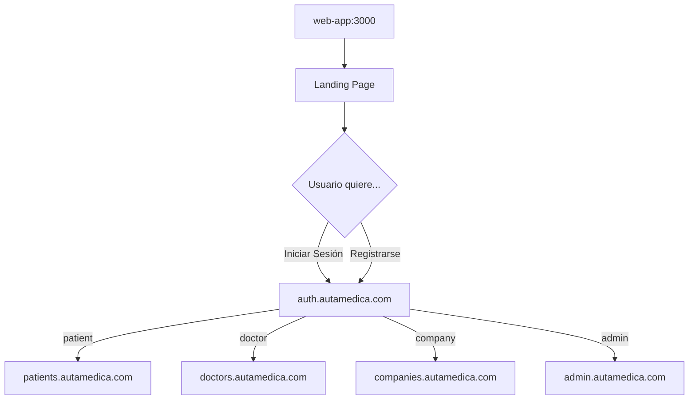

# 🌐 AutaMedica Web-App

> **Landing Page & Marketing** para la plataforma AutaMedica Healthcare.
> Página de entrada con información de marketing y enlaces a apps especializadas.

## 🎯 **Funcionalidades Principales**

- 🏠 **Landing Page Profesional** con experiencia médica moderna
- 📱 **Marketing Content** optimizado para conversión
- 🎨 **Responsive Design** con branding AutaMedica
- 🔗 **Enlaces** a aplicaciones especializadas (auth, doctors, patients, companies)
- ⚡ **Performance Optimizado** para SEO y Web Vitals

## 🚀 **Desarrollo Local**

```bash
# Instalar dependencias (desde root del monorepo)
pnpm install

# Desarrollo solo web-app
pnpm dev --filter @autamedica/web-app

# Desarrollo con todas las apps
pnpm dev

# Build production
pnpm build --filter @autamedica/web-app
```

**URL Local**: http://localhost:3000

## 🏗️ **Arquitectura**

### **Rutas Principales**
```
/                          # Landing page + Hero section
/terms                    # Términos de servicio HIPAA
/privacy                  # Política de privacidad médica
```

### **Enlaces a Apps Especializadas**
```typescript
// Redirección a apps especializadas
APPS = {
  'auth' → https://autamedica-auth.pages.dev (login/register)
  'patients' → https://autamedica-patients.pages.dev
  'doctors' → https://autamedica-doctors.pages.dev
  'companies' → https://autamedica-companies.pages.dev
  'admin' → https://autamedica-admin.pages.dev
}
```

## 🎨 **UI/UX Médico**

### **Componentes Principales**
- `EnhancedLandingExperience` - Experiencia landing completa
- `HeroSection` - Sección principal con llamada a la acción
- `AccountMenu` - Menú con enlaces a auth app
- `MedicalFooter` - Footer con links médicos
- `ResponsiveNav` - Navegación adaptativa

### **Design System**
- **Colores AutaMedica**: Azul médico + contraste HIPAA
- **Tipografía**: Inter font optimizada para lectura médica
- **Animaciones**: Framer Motion + GSAP
- **Responsive**: Mobile-first design

## 🚀 **Deployment**

### **Cloudflare Pages**
- **URL Producción**: https://autamedica-web-app.pages.dev + www.autamedica.com
- **Build Command**: `pnpm turbo run build --filter=@autamedica/web-app`
- **Output Directory**: `.next/`
- **Root Directory**: `apps/web-app`

### **Configuración Cloudflare**
```bash
# Variables de entorno en Cloudflare Pages
NEXT_PUBLIC_AUTH_APP_URL=https://autamedica-auth.pages.dev
NODE_ENV=production
HUSKY=0
```

## 📦 **Dependencies**

### **Core**
- `next`: ^15.5.4 (App Router + Server Components)
- `react`: ^18.3.1
- `typescript`: 5.9.2

### **Animaciones & UX**
- `framer-motion`: ^12.23.12
- `gsap`: ^3.13.0

### **Styling**
- `tailwindcss`: ^3.4.0
- `@autamedica/tailwind-config`: workspace:^

## 🔧 **Scripts Disponibles**

```bash
pnpm dev          # Desarrollo con hot reload
pnpm build        # Build optimizado para producción
pnpm start        # Servidor de producción
pnpm lint         # ESLint + TypeScript check
pnpm typecheck    # Solo verificación TypeScript
```

## 🏥 **Integración con Ecosystem AutaMedica**

Esta app es el **punto de entrada de marketing** del ecosystem multi-app:



## 📝 **Notas de Arquitectura**

- **Sin autenticación**: La autenticación se maneja en la app `auth` separada
- **Solo marketing**: Esta app se enfoca en landing page y contenido de marketing
- **Performance first**: Optimizada para SEO y Web Vitals
- **Zero dependencies auth**: No usa Supabase ni librerías de autenticación

## 📄 **Licencia**

Proprietary - AutaMedica Healthcare Platform © 2025
