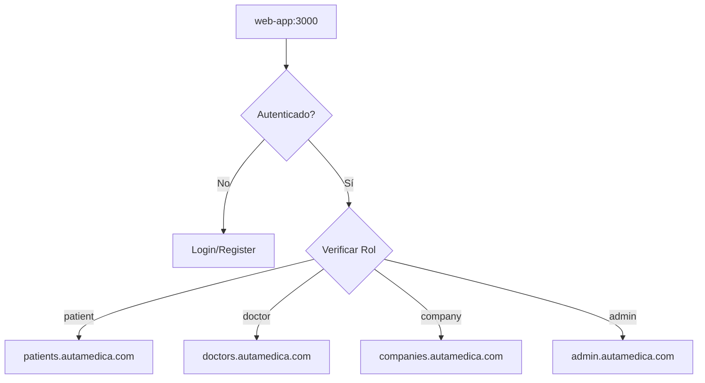

# 🌐 AutaMedica Web-App

> **Landing Page Central + Sistema de Autenticación** para la plataforma AutaMedica Healthcare.
> Punto de entrada único con redirección automática según roles de usuario.

## 🎯 **Funcionalidades Principales**

- 🏠 **Landing Page Profesional** con experiencia médica moderna
- 🔐 **Autenticación Centralizada** con Supabase
- 🔄 **Redirección Automática** según rol del usuario
- 📱 **OAuth Completo**: Google, GitHub, Magic Links
- 📋 **Términos HIPAA** y política de privacidad médica
- 🎨 **Responsive Design** con branding AutaMedica

## 🚀 **Desarrollo Local**

```bash
# Instalar dependencias (desde root del monorepo)
pnpm install

# Desarrollo solo web-app
pnpm dev --filter @autamedica/web-app

# Desarrollo con todas las apps
pnpm dev

# Build production
pnpm build --filter @autamedica/web-app
```

**URL Local**: http://localhost:3000

## 🏗️ **Arquitectura**

### **Rutas Principales**
```
/                          # Landing page + Hero section
/auth/login               # Página de login con OAuth
/auth/register            # Registro de usuarios médicos
/auth/callback            # Callback OAuth (Google, GitHub)
/auth/select-role         # Selección de rol post-registro
/auth/forgot-password     # Recuperación de contraseña
/terms                    # Términos de servicio HIPAA
/privacy                  # Política de privacidad médica
```

### **Redirección Automática por Rol**
```typescript
// Flujo de autenticación
USER_ROLES = {
  'patient' → https://autamedica-patients.pages.dev
  'doctor' → https://autamedica-doctors.pages.dev
  'company' → https://autamedica-companies.pages.dev
  'admin' → https://autamedica-admin.pages.dev
}
```

## 🔐 **Autenticación Supabase**

### **Configuración**
```typescript
// lib/supabase.ts
createBrowserClient(
  NEXT_PUBLIC_SUPABASE_URL,
  NEXT_PUBLIC_SUPABASE_ANON_KEY
)
```

### **OAuth Providers**
- ✅ **Google OAuth** configurado
- ✅ **GitHub OAuth** configurado
- ✅ **Magic Links** via email
- ✅ **Password recovery** implementado

### **Variables de Entorno**
```bash
NEXT_PUBLIC_SUPABASE_URL=https://gtyvdircfhmdjiaelqkg.supabase.co
NEXT_PUBLIC_SUPABASE_ANON_KEY=NUEVA-ANON-KEY-ROTADA..
```

## 🎨 **UI/UX Médico**

### **Componentes Principales**
- `HeroSection` - Sección principal con llamada a la acción
- `AuthForms` - Formularios de login/registro
- `MedicalFooter` - Footer con links médicos
- `ResponsiveNav` - Navegación adaptativa

### **Design System**
- **Colores AutaMedica**: Azul médico + contraste HIPAA
- **Tipografía**: Inter font optimizada para lectura médica
- **Iconografía**: Lucide icons médicos
- **Responsive**: Mobile-first design

## 🚀 **Deployment**

### **Cloudflare Pages**
- **URL Producción**: https://autamedica-web-app.pages.dev
- **Build Command**: `pnpm turbo run build --filter=@autamedica/web-app`
- **Output Directory**: `.next/`
- **Root Directory**: `apps/web-app`

### **Configuración Cloudflare**
```bash
# Variables de entorno en Cloudflare Pages
NEXT_PUBLIC_SUPABASE_URL=https://gtyvdircfhmdjiaelqkg.supabase.co
NEXT_PUBLIC_SUPABASE_ANON_KEY=eyJh...
NODE_ENV=production
HUSKY=0
```

## 📦 **Dependencies**

### **Core**
- `next`: 15.5.0 (App Router + Server Components)
- `react`: 18.2.0
- `typescript`: 5.9.2

### **Autenticación**
- `@supabase/supabase-js`: ^2.39.0
- `@autamedica/auth`: workspace:^ (SSO package)

### **UI/Styling**
- `tailwindcss`: ^3.4.0
- `@autamedica/tailwind-config`: workspace:^
- `lucide-react`: ^0.263.1

## 🔧 **Scripts Disponibles**

```bash
pnpm dev          # Desarrollo con hot reload
pnpm build        # Build optimizado para producción
pnpm start        # Servidor de producción
pnpm lint         # ESLint + TypeScript check
pnpm type-check   # Solo verificación TypeScript
```

## 🏥 **Integración con Ecosystem AutaMedica**

Esta app es el **punto de entrada** del ecosystem multi-app:



## 📄 **Licencia**

Proprietary - AutaMedica Healthcare Platform © 2025
