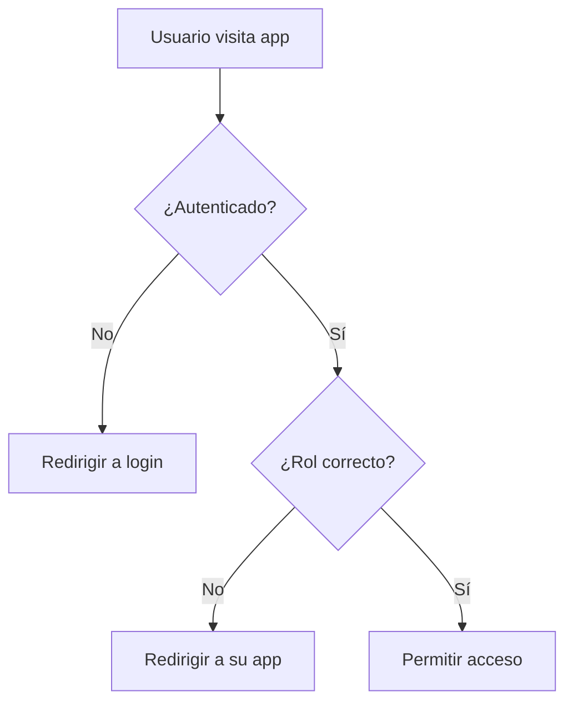

# @autamedica/auth

Package centralizado de autenticación para la plataforma AutaMedica.

## 🎯 Características

- **SSO (Single Sign-On)** entre todas las aplicaciones
- **Validación de roles** por aplicación (1 usuario = 1 rol = 1 app)
- **Cookies compartidas** en el dominio `.autamedica.com`
- **Middleware de protección** para Next.js
- **Gestión de sesiones** unificada con timeout automático
- **Redirección inteligente** post-login con prioridades

## 📦 Instalación

```bash
pnpm add @autamedica/auth
```

## 🚀 Uso Rápido

### 1. Configurar Middleware (app/middleware.ts)

```typescript
import { createAppMiddleware } from '@autamedica/auth/middleware'

// Para app de pacientes
export const middleware = createAppMiddleware('patients')

// Para app de doctores
export const middleware = createAppMiddleware('doctors')

// Para app empresarial
export const middleware = createAppMiddleware('companies')

// Para app admin
export const middleware = createAppMiddleware('admin')

export const config = {
  matcher: [
    '/((?!api|_next/static|_next/image|favicon.ico).*)',
  ],
}
```

### 2. Envolver App con AuthProvider

```tsx
// app/layout.tsx
import { AuthProvider } from '@autamedica/auth'

export default function RootLayout({ children }) {
  return (
    <html>
      <body>
        <AuthProvider>
          {children}
        </AuthProvider>
      </body>
    </html>
  )
}
```

### 3. Usar Hooks de Autenticación

```tsx
// components/Header.tsx
import { useAuth } from '@autamedica/auth'

export function Header() {
  const { user, profile, signOut } = useAuth()

  if (!user) return null

  return (
    <header>
      <span>Hola, {profile?.first_name}</span>
      <span>Rol: {profile?.role}</span>
      <button onClick={signOut}>Cerrar Sesión</button>
    </header>
  )
}
```

## 🏗️ Arquitectura

### Roles y Apps

```typescript
// Mapeo de roles a aplicaciones
const ROLE_APP_MAPPING = {
  'patient': 'patients',
  'doctor': 'doctors',
  'company': 'companies',
  'company_admin': 'companies',
  'platform_admin': 'admin'
}

// Roles permitidos por app
const APP_ALLOWED_ROLES = {
  'patients': ['patient'],
  'doctors': ['doctor'],
  'companies': ['company', 'company_admin'],
  'admin': ['platform_admin']
}
```

### Flujo de Autenticación

1. **Usuario sin autenticar** → Redirigir a `/auth/login` en web-app
2. **Login exitoso** → Verificar rol del usuario
3. **Redirección por prioridad**:
   - Si hay `returnUrl` válido → usar returnUrl
   - Si hay `lastPath` guardado → restaurar última ruta
   - Si no → `/dashboard` de la app correspondiente

### Validación de Acceso



## 🔐 Seguridad

- **Cookies HTTPOnly** con dominio compartido
- **PKCE flow** para mayor seguridad OAuth
- **Validación server-side** en middleware
- **Sanitización de returnUrl** para prevenir open redirects
- **Session refresh** automático antes de expiración

## 🌍 Configuración por Entorno

```typescript
// Producción
{
  base: 'autamedica.com',
  cookie: '.autamedica.com',
  apps: {
    web: 'https://autamedica.com',
    patients: 'https://patients.autamedica.com',
    // ...
  }
}

// Staging
{
  base: 'stg.autamedica.com',
  cookie: '.stg.autamedica.com',
  // ...
}

// Development
{
  base: 'localhost',
  cookie: 'localhost',
  apps: {
    web: 'http://localhost:3000',
    patients: 'http://localhost:3003',
    // ...
  }
}
```

## 📚 API Completa

### Hooks

- `useAuth()` - Estado de autenticación y métodos
- `useRequireAuth(redirectUrl?)` - Requiere autenticación
- `useRequireRole(roles[], redirectUrl?)` - Requiere roles específicos

### Utilidades

- `getRedirectUrl(role, returnUrl?, lastPath?)` - URL de redirección
- `isCorrectAppForRole(app, role)` - Validar app para rol
- `signOutGlobally()` - Cerrar sesión en todas las apps

### Middleware

- `authMiddleware(request, options)` - Middleware base
- `createAppMiddleware(appName)` - Middleware preconfigurado por app

## 🧪 Testing

```bash
# Build del package
pnpm build

# Type checking
pnpm type-check

# Linting
pnpm lint
```

## 📝 Licencia

Propiedad de AutaMedica. Uso interno únicamente.